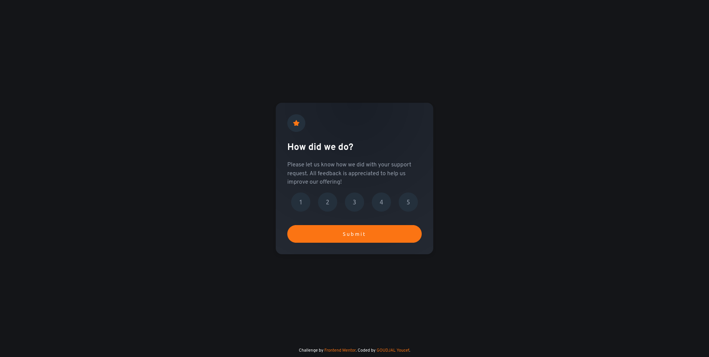
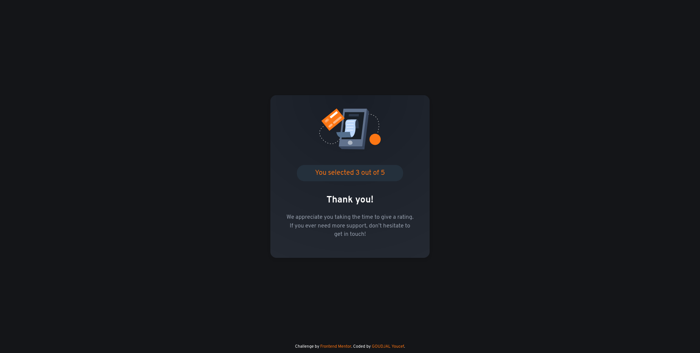
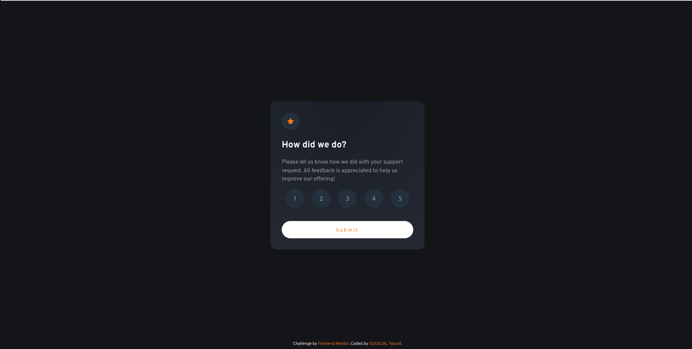
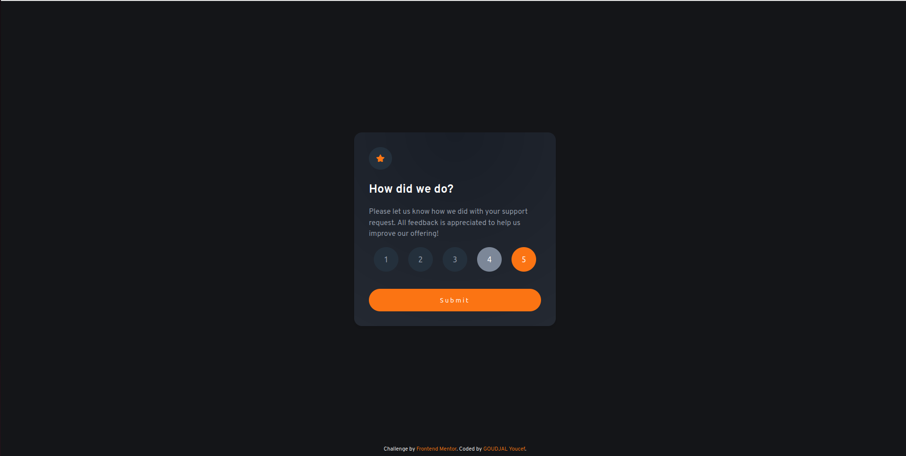
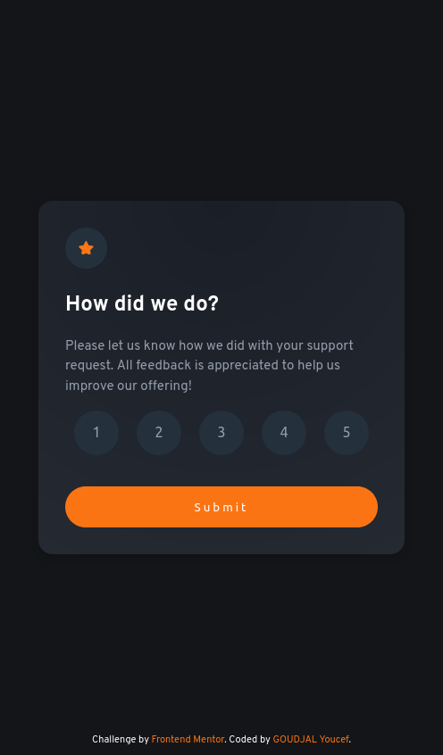
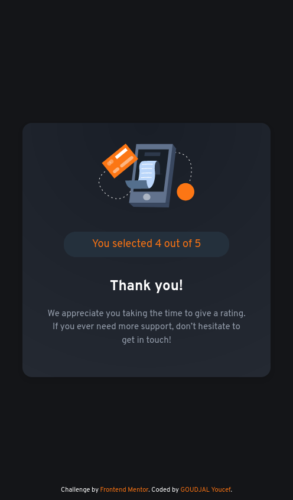

# Frontend Mentor - Interactive rating component solution

This is a solution to the [Interactive rating component challenge on Frontend Mentor](https://www.frontendmentor.io/challenges/interactive-rating-component-koxpeBUmI). Frontend Mentor challenges help you improve your coding skills by building real projects.

## Table of contents

- [Frontend Mentor - Interactive rating component solution](#frontend-mentor---interactive-rating-component-solution)
  - [Table of contents](#table-of-contents)
  - [Overview](#overview)
    - [The challenge](#the-challenge)
    - [Screenshots](#screenshots)
    - [Links](#links)
  - [My process](#my-process)
    - [Built with](#built-with)
    - [What I learned](#what-i-learned)
    - [Continued development](#continued-development)
  - [Author](#author)

## Overview

### The challenge

Users should be able to:

- View the optimal layout for the app depending on the device's screen size
- See hover states for all interactive elements on the page
- Select and submit a number rating
- See the "Thank you" card state after submitting a rating

### Screenshots

Desktop-design

Active states

Mobile-design

### Links

- Solution URL: [Repository](https://github.com/Youcef-Goudjal/frontend-challenges/tree/main/interactive-rating-component)
- Live Site URL: [demo](https://youcef-goudjal.github.io/frontend-challenges/interactive-rating-component/?#)

## My process

### Built with

- Semantic HTML5 markup
- CSS custom properties
- Flexbox
- Responsive design
- JS

### What I learned

While doing this challenge, I got introduced to JS and learned some methods like getElementById(), querySelectorAll(), forEach() and addEventListener().

### Continued development

In future projects, I would like to focus on learning JS and coding better.

## Author

- Frontend Mentor - [@Youcef-Goudjal](https://www.frontendmentor.io/profile/Youcef-Goudjal)
- GitHub - [@Youcef-Goudjal](https://github.com/Youcef-Goudjal)
